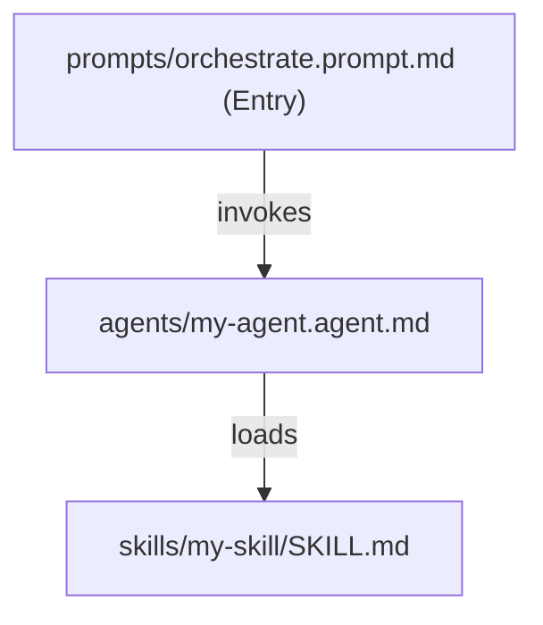
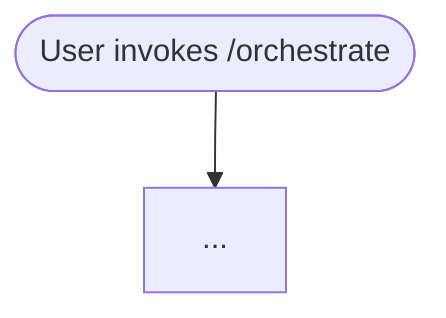

# Authoring Kits

## Overview
A skill kit is a self-contained package of skills, agents, instructions, and prompts that work as a unit and are typically initiated via an orchestration prompt.

## Folder Structure

```
kits/<namespace>-<kit-name>.kit/
├── README.md                        # REQUIRED — usage + details
├── kit.json                         # REQUIRED — manifest; must include $schema
├── architecture.md                  # REQUIRED — Mermaid diagram of artifact relationships
├── workflows.md                     # REQUIRED — Mermaid diagram of process flows
├── skills/<skill-name>/SKILL.md     # skill instructions and supporting assets
├── agents/*.agent.md                # custom agent definitions
├── instructions/*.instructions.md   # behavioral instructions (only if applicable)
└── prompts/*.prompt.md              # orchestration prompt lives here
```

## kit.json Requirements

- Must include `"$schema": "../../schemas/kit.schema.json"` for VS Code autocomplete and CI validation.
- `namespace` must NOT include a trailing dash.
- `name` should follow the pattern `<namespace>-<kit-name>`.
- `entryPrompt` should point to the orchestration prompt (relative to the kit root).
- `files` globs are relative to the kit root.
- `requires` and `conflicts` use npm-style semver strings: `"namespace-name@^1.0.0"`.

See [kit.json Field Reference](./kit-manifest.md) for all fields.

## architecture.md Requirements

Must contain a Mermaid diagram showing how artifacts relate to each other:



## workflows.md Requirements

Must contain a Mermaid flowchart showing the processes the kit implements:



## Conventions

- Kit artifacts are independent copies — do not cross-reference other kits or the top-level standalone folders.
- `status` should be `preview` until the kit has been validated end-to-end.
- Promote `status` to `stable` only after running `scripts/validate-kits.sh` cleanly.

## Checklist

- [ ] All four required files exist at the kit root
- [ ] `kit.json` includes `$schema` and validates cleanly
- [ ] `architecture.md` has a Mermaid diagram
- [ ] `workflows.md` has a Mermaid diagram
- [ ] `entryPrompt` points to an existing prompt file
- [ ] `files` globs resolve to real files
- [ ] Row added to root `README.md` Skill Kits table
