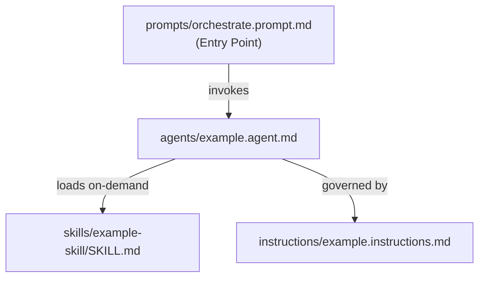

# Architecture

Artifact relationships within the **example-kit**.

```mermaid
graph TD
    OP["prompts/orchestrate.prompt.md\n(Entry Point)"]
    AG["agents/example.agent.md"]
    SK["skills/example-skill/SKILL.md"]
    IN["instructions/example.instructions.md"]

    OP -->|"invokes"| AG
    AG -->|"loads on-demand"| SK
    AG -->|"governed by"| IN
```

## Legend

| Shape | Meaning |
|-------|---------|
| Rectangle | Artifact |
| Arrow | Dependency or invocation relationship |
