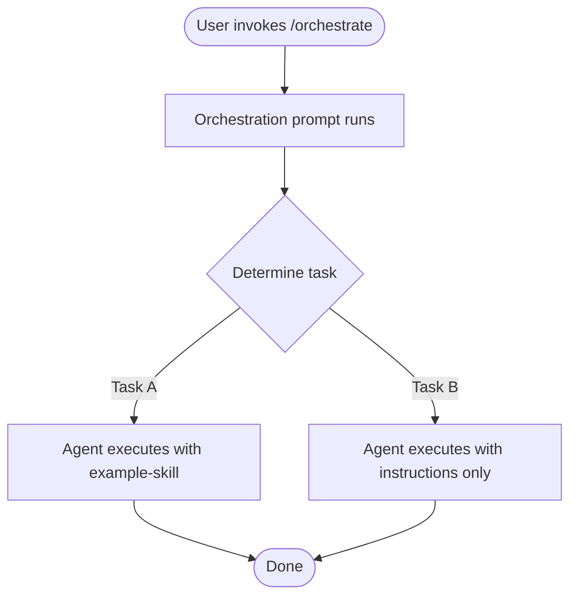

# Workflows

Process flows implemented by the **example-kit**.

## Workflow 1 — Primary Orchestration

## Notes

- The orchestration prompt (`prompts/orchestrate.prompt.md`) is the recommended entry point but not mandatory.
- Individual skills, agents, instructions, and prompts can be invoked independently.
